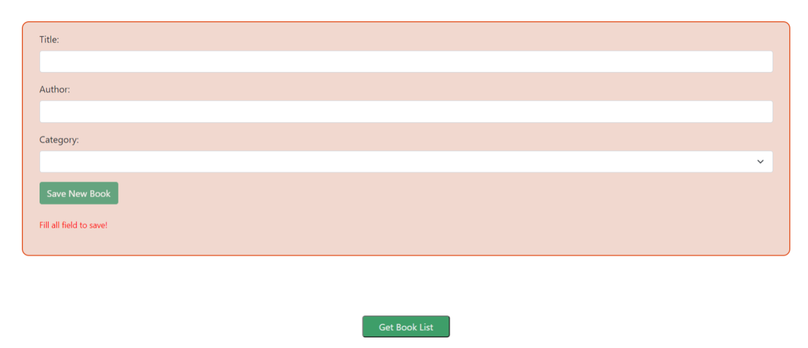
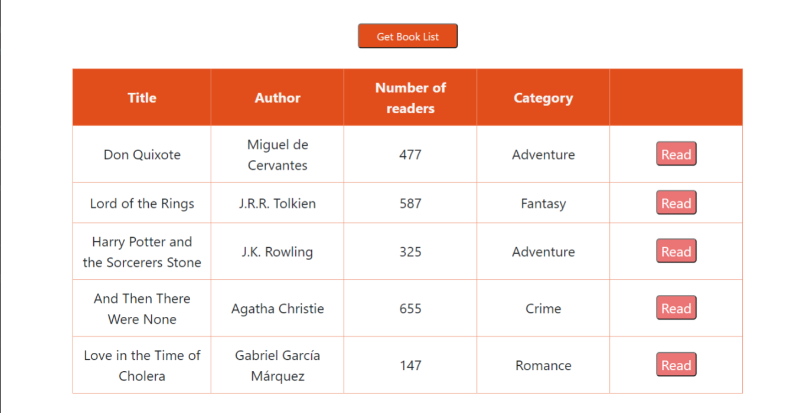
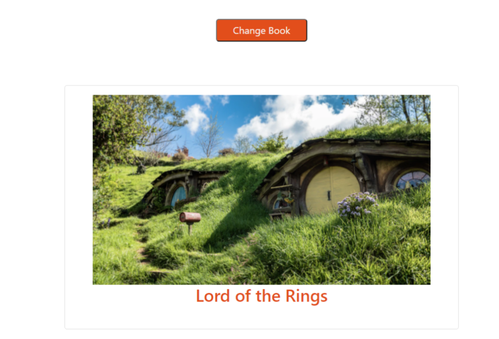

# 1. FELADAT:
**Funkcionális programozás és algoritmus alapok** (15 pont összesen)

Ha még nem tetted meg telepítsd a teszteléshez szükséges függőségeket! (JS-task mappa)
A __test__ mappákban találod a teszteket. Értelmezd őket! 

Feladatod, hogy sikeresen lefussanak a tesztek!
- forrás file:  ```task01-algorithm/main.js``` és ```index.html```

Az index.html csak a vizuális ellenőrzés lehetőségét adja, 
teszt szempontjából lényegtelen tartalma

Adott egy objektumlista ("bookCollection"), amelyben 7 könyv adatai találhatók. Le szeretnénk szűrni ezeket a könyveket két szempont szerint:
 - hardcopy-e a kiadás (true vagy false)
 - kiadás éve szerint (későbbi évben jelent meg, mint a paraméter)

Adott egy  "bookSorter()" metódust. Benne kell a logikát megírnod:
- A metódus három paramétert kap: az eredeti listát, az évet, igaz-e, hogy hardcopy (boolean). 
- A metódus a szűrést követően adja vissza a leszűrt listában csak a könyv címeket!
- A tökéletes megoldáshoz törekedj a "Clean Code" és a funkcionális programozás elveire!


# 2. FELADAT:
**DOM manipuláció** (20 pont összesen)

- forrás file: => ```task02-dom/dom.js, index.html```

Az index.html megnyitása, használata csak a vizuális ellenőrzés lehetőségét adja, 
teszt szempontjából lényegtelen tartalma

Adott az index.html-ben egy "section", egy "p" és egy "div" elem. A "div" elemben egy "ul" elem, megjelölve egy "id=container" attribútummal.
Adott egy "getMyBookList()" függvény a dom.js fille-ban.

1. Feladat: a megadott függvény logikájának megírása.
A js fileban létrehozott 'bookCollection' objektumlista elemeit vizsgálja:

- Ha az adott objektum 'isRead' mezője "true",
  akkor a listában írja ki a következő vastag betűs mondatot: "Ezt a könyvet már olvastad: " ('strong' elem segítségével) + az adott könyv  címét. 
- Az olvasatlan könyvek címe a kiemelt szöveg nélkül jelenjen meg
- Figyelj arra, hogy a kirenderelt lista hossza ne változzon, még ha többször is meghívnánk a "getMyBookList" függvényt!


2. Feladat: Manipuláld a megadott elemek stílusjegyeit a "configStyle" függvényben: 
- Legyen a "section" körül border: 3 px vastag és "red" színű

A "div" elem két stílust kapjon:
- legyen "flex" a megjelenítése
- az elsődleges tengelyen legyen középre zárva

A "p" elem két stílust kapjon:
- a szöveg legyen középen
- a szöveg színe legyen piros

Kösd össze a két metódust! Hogy minden a listMyBook metódus hívásakor minden művelet megfelelően lefusson.

**Egy segéd kép:**


# ANGULAR Projekt

Telepítsd a node package manager-rel a szükséges függőségeket! (angular-book-project mappa)

- 3 komponens szelektorát már elhelyeztük az app komponensben. Neked az egyes komponensek file-jaiban kell majd dolgoznod.
- Összes JASMINE test futtatása: npm run test 
- Fejlesztés alatt érdemes külön az egyes komponensre futattni a teszteket (lásd később)


## 3. FELADAT
**Űrlap és validátorok használata** (20 pont összesen)

(forrás: Book komponens).

Ehhez a komponenshez tartozó teszt futtatása: ```ng test --include='**/book/*.spec.ts'.```

Feladathoz egy segéd kép:



1. Készíts Bootsrap segítségével egy űrlapot, amivel könyveket lehet regisztrálni.
2. Készíts egy "md" méretü container-t (bootstrap osztály) a html "section" eleméből.
Adj háttérszínt a konténernek: rgb(241, 216, 207). Kerekítsd le kicsit az éleit: border-radius: 12px, a border legyen: 2px solid rgb(226, 78, 27)
3. Helyezz el benne egy bootstrap formot a következő beviteli mezőkkel:

-  LABEL és INPUT mező (bootstrap osztály használat LABEL-re és INPUT-ra) input mező típusa: "text" , id="title". A label for attribútuma mutasson az input mező id-ra.
Label mező belső szöveges tartalma: "Title:"

- LABEL és INPUT mező (bootstrap osztály használat LABEL-re és INPUT-ra) input mező típusa: "text", id="author". A label for attribútuma mutasson az id-ra.
Label mező belső szöveges tartalma: "Author:"

- LABEL és SELECT mező (bootstrap osztály használat LABEL-re és SELECT-re). select mező id="category". A label for attribútuma mutasson az id-ra.
Label mező belső szöveges tartalma: "Category:"
Választható opciók és értékek a select mező esetében: "Adventure", "Crime", "Romance" 

Valamennyi LABEL szöveg színkódja legyen: "dark"


4. Helyezz el egy gombot a form végén. Bootstrap osztályt használj, szín típus a BUTTON elemen: "success". Felirata: "Save New Book"
Ha a form "invalid" (bármelyik mezője nem kap értéket), akkor a gomb "disabled", vagyis nem kattintható.

5. Helyezz el egy "small" elemet a gomb alá a következő  szöveges tartalommal: "Fill all field to save!"
Használj Bootstrap class-t a szöveg színezésére ("danger" szinkód)
Ha érvénytelen a form, meg kell jelennie az figyelmeztető üzenetnek. Ha érvényes a kitöltés, akkor kattintható a gomb és eltűnik az üzenet.

6. Készíts egy reaktivForm-ot a következő validátorokkal:

(Figyelj arra hogy sima formGroup-ot hozz létre! A controllerek elnevezése legyenek megegyezőek a megfelelő html elem "id" értékeivel!)

- title: input mező min 5 max 25 karakterből állhat
- author: input mező csak betű karaktereket és szóközt fogadhat el, nem lehet szám, vagy speciális karakter (kivéve '.' karakter). A szöveg hossza 5 és 30 karakter között kell, hogy legyen.
- category: select mező kijelöltnek kell lennie (választania kell a felhasználónak)

7. Adott egy "saveBook" metódus. Visszatérési értékei legyenek a form értékei (kulcs-érték párjai a controllereknek).
Ha minden beviteli mező helyesen van kitöltve, és rákattint a felhasználó a "Save New Book" gombra, akkor le kell futnia a metódusnak. Elég most csak a konzolra kiíratni az értékeket."

## 4. FELADAT:
- **HTTP hívás, renderelés, SCSS használata** (15 pont összesen)

(forrás: Book-list komponens).

Ehhez a komponenshez tartozó teszt futtatása: ```ng test --include='**/book-list/*.spec.ts'```

_Megjegyzés: a tesztekhez nem kell JSON-SERVER-t használni, csak a müködés vizuális ellenőrzéséhez kell futtatni._

### Json-server futtatása a teszteléshez
Az adatbázis fájl elérési útja (fontos, hogy az angular projekt legyen a gyökér):  
`server/db.json`

1. Készíts egy sima táblázatot az alábbi elemekkel:
- Adott egy táblázat egy 'section' (class="table-section") elemen belül 
- Adott a táblázatban egy 'thead' elem.
Hozz létre benne egy sorban 5 oszlopot ('th') elem: Szöveges tartalmak: 'Title', 'Author', 'Number of readers', 'Category' + egy üres oszlop elem
- Adott egy 'tbody' elem is. Benne kell majd megjeleníteni direktíva segítségével a  ts. file-ban található "bookList" nevű lista elemeket soronként. A ciklusban megjelenő 'tr' elemeket lásd el class="table-row" jelöléssel.
2. Adott egy httpService osztály, és egy "getBookList" metódus a service mappában. HttpClient és a metódus segítségével készíts egy "GET" lekérdezést a server mappa alatt taláható db.json file-ban lévő "books" listára.
3. Kösd össze a Book-list komponessel a service osztályt. Ehhez adott még a html tartalomban egy 'button' elem (id="get-button"), és egy üres metódus a ts file-ban ("getBookList"). 
Ha a gombra kattintunk ki kell renderelődnie az oldalnak, és megjeleníteni a serveren található objektumoknak megfelelő tartalmait ('td' elemeken belül):

**Egy segédkép a megoldáshoz:**




4. Az ötödik oszlopban helyez el a 'td' elemen belül egy gombot. Felirata: "Read". Jelöld meg a id="read-button" attributummal. Kösd össze ezt a gombot a ts. file-ban lévő üres "readBook" metódussal.
Ha gombra kattintanak, akkor a service osztályon keresztül történő 'PUT' http hívással hozzá kell adni az adott elem numberOfRead fieldjéhez egyet a serveren található listában.
Amikor a PUT hívás lefutott('complete'), akkor hívódjon meg ismét egy GET kérés és frissüljön meg a lista (html-ben történő megjelenésben is).

5. Formázd meg kicsit a táblázatodat, használj fel adott szineket, és mixin-eket és ágyazd egymásba a szelektorokat a "nesting" segitségével!
Törekedj arra, hogy a scss tartalom a 'table-section' elemből eredjen, és minden más szelektor beágyazott legyen (nesting használata)!

 Adott 3 mixin különböző stílus jegyekkel a _mixin.scss file-ban:
- "book-background-style"  ("th" elem és Get Book List gomb formázása)
- "set-text" (a táblázat "th", "td" és a Get Book List gomb formázásához
- "read-style" (A "Read" button formázásához)

- Használd fel a "Get Book List" feliratú gombhoz, a fejléc és adatok formázásához a  "set-text-style"  mixin-t.

 Táblázat jelenjen meg középen, a 'table-holder' jelöléssel ellátott 'section' elem beállításai: 
- Használj flex-box-ot. A flex-direction oszlopos rendezésében helyezd a beltartartalmakat középre (table, és getBooks button)
- a 'read-button' elem formázásához  használd a 'read-style' mixin-t.
- a 'thead és tr'  háttérszíne legyen (background-color): rgb(226, 78, 27).
- Minden tovább egyéni formázás megengedett.

Segítségül van egy másolat az adatbázisról a db-recap.json file-ban. (server/backup mappa alatt)

## 5. FELADAT
- **Szülő-Gyerek komponens interakció, adatkötések** (15 pont összesen)

(forrás: Book-details- és App-komponens)

- Tesztek futtatása (adatkötések): ```ng test --include='**/book-details/*.spec.ts'```
- App Komponens (interakció teszt):  ```ng test --include='**/app/*.spec.ts'```

1. Adott a book-details tamplate-jében egy class="detail-section" jelöléssel elátott 'section elem
2. Helyezz el benne egy 'div' elemet (class="card"), 
3. A 'div'-en belül helyezz el 2 elemet: egy 'img' és egy 'h3' elem.
4. Kösd össze az elemek megfelelő tartalmait a ts. file-ben lévő "chosenBook" property-vel. Adatkötéseket használj.

 **Segítségül egy kép:**




5. A szülő (App) komponensben van:
- egy 'button' elem az app.component.html file-ban ('Change book').
- az app.component.ts-ben egy üres "changeBook" metódus,
- és egy "bookList" lista

6. Kösd össze a szülő-gyerek komponenst. Ha a gombra kattintanak, ki kell választani a szülőnek a listában következő objektumot a "bookList"-ből, 
és át kell adni a gyerek komponensnek az objektumot. 
A kártya adatainak, és képének meg kell változnia a kiválasztott elemnek megfelelően. Használj Input() dekorátort a megfelelő helyen.

7. Formázd meg a kártyát kicsit:
**Kártya ("card")** beállítása:
-  szélessége: 650px. 
-  Helyezd középre. Alul-felül 3%, oldalt automatikus margin
-  Padding mértéket minden oldalról 1rem
- **Img elem:** 90% széles, középen jelenjen meg a kártyán (ugyan az a  margin beállítás mint "card" elemen)
- h3 szövege középen legyen  (text-align), szöveg szín: rgb(226, 78, 27);

## 6. FELADAT:
 - **Github deploy** (15 pont összesen).
 
 - Github Deploy (15 pont összesen).

1. Állítsd be a Github fiókodban a saját Github oldalad. (https://docs.github.com/en/github/working-with-github-pages/creating-a-github-pages-site)
2. Klónozd le az oldalad repo -ját a gépedre.
3. Builded le az alkalmazást.
3. A dist/<projekt név> tartalmát töltsd fel a github pages -re.
5. Az elkészült komponenseknek meg kell jelenniük a külső url hivatkozáson.
